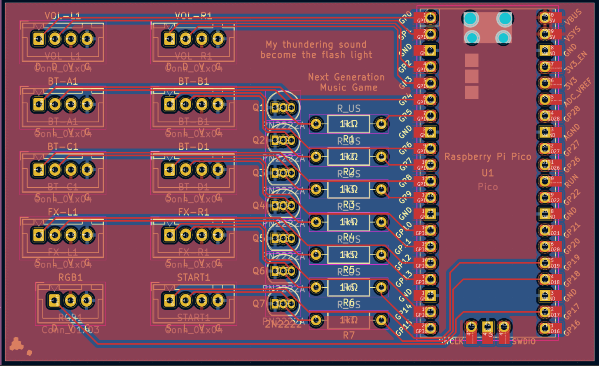

# SDVX Pico PCB

A quick and dirty custom PCB I designed for use with a Raspberry Pi Pico. Wired up for 7 buttons and 2 knobs, and option WS2812B strip. Connectors are JST-XH, with button LEDs running off of 5V. Because of that, I used 2N2222 BJTs to toggle the LEDs off of the 3.3V on the pico.

Indended for use with a slightly tweaked [Pico-Game-Controller](https://github.com/huantianad/Pico-Game-Controller). You may have to edit the encoder PPR and encoder inversion settings.

